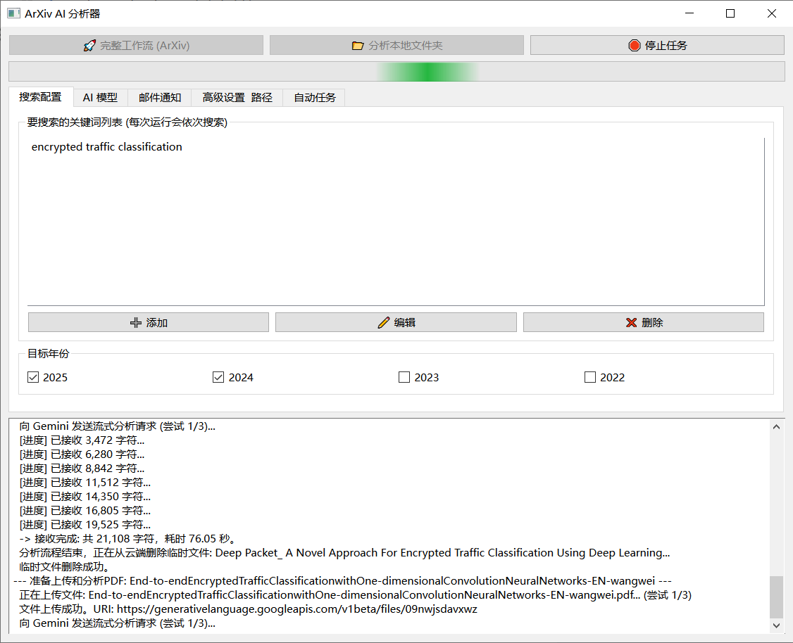

# ArXiv AI 分析器 (ArXiv AI Analyzer)

一个功能强大的自动化工具，旨在帮助科研人员和开发者追踪、分析和总结特定领域的最新 arXiv 论文。本工具深度集成了 Google Gemini 模型，能够将复杂的学术论文转化为结构清晰、内容详尽的 HTML 分析报告，并通过邮件自动推送给您。

## 📸 项目截图



## ✨ 主要功能

* **🚀 自动化论文追踪**: 根据您设定的关键词和年份，自动从 arXiv 网站抓取最新的论文列表。
* **🧠 Gemini 驱动的深度分析**: 利用 Google Gemini 的强大能力，对每篇论文进行深度剖析，生成包含**核心解析**和**复现路线图**的详细 HTML 报告。
* **🖥️ 友好的图形用户界面**: 基于 PyQt6 构建了现代化且易于操作的用户界面，让您可以轻松配置所有参数，包括搜索、AI 模型、邮件、代理和定时任务。
* **📧 智能邮件通知**: 自动将新发现的论文、AI 分析报告（HTML）、论文原文（PDF）等附件打包，通过邮件发送给您。支持成功、失败及无更新等多种报告模式。
* **⏰ Windows 定时任务**: 可直接在 GUI 中创建、管理和删除 Windows 系统级别的定时任务，实现无人值守的自动化运行。
* **💪 健壮的执行流程**:
    * 支持失败任务的单独重试。
    * 通过状态管理，避免对已成功分析和报告的论文进行重复操作。
    * 支持通过 HTTP/HTTPS 代理进行网络访问。

## 📂 项目结构

本项目采用了清晰的模块化结构，便于维护和二次开发。

```
/arxiv_ai_analyzer/
├── src/
│   └── arxiv_analyzer/
│       ├── __init__.py
│       ├── gui/            # GUI 相关模块
│       ├── core/           # 核心工作流模块
│       ├── utils/          # 工具类模块 (配置、通知、爬虫)
│       └── cli/            # 命令行/后台任务模块
├── .gitignore
├── LICENSE
├── README.md
├── requirements.txt
└── gui_main.py             # 主程序入口
```

## 🚀 快速开始

请遵循以下步骤在您的本地环境中运行本项目。

### 1. 克隆项目

```bash
git clone [https://github.com/YOUR_USERNAME/arxiv_ai_analyzer.git](https://github.com/YOUR_USERNAME/arxiv_ai_analyzer.git)
cd arxiv_ai_analyzer
```

### 2. 安装依赖

建议在 Python 虚拟环境中安装项目所需的依赖。

```bash
pip install -r requirements.txt
```
*(注: `requirements.txt` 文件需要您通过 `pip freeze > requirements.txt` 命令在您的环境中生成。)*

### 3. 进行配置

这是运行本应用最关键的一步。

1.  在项目根目录中，找到 `config.template.json` 文件。
2.  复制该文件并重命名为 `config.json`。
3.  打开 `config.json`，**填入您自己的个人信息**，尤其是以下字段：
    * `api_key`: 您的 Google Gemini API 密钥。
    * `email_sender`: 您的发件人邮箱地址。
    * `email_password`: 您的邮箱授权码（**注意：不是邮箱登录密码**）。
    * `email_receiver`: 您的收件人邮箱地址。

### 4. 运行程序

一切就绪后，通过以下命令启动图形用户界面：

```bash
python gui_main.py
```

## 🛠️ 使用说明

### 图形界面模式 (GUI)

直接运行 `gui_main.py` 即可打开主窗口。您可以在不同的标签页中完成所有配置，然后点击 "完整工作流" 或 "仅重试失败" 按钮来启动任务。所有日志将实时显示在下方的文本框中。

### 无界面后台模式 (Headless)

如果您希望通过脚本或定时任务在后台运行，可以使用 `--run-task` 参数。这在服务器上部署时尤其有用。

```bash
python gui_main.py --run-task
```
此命令将直接执行一次“完整工作流”，并将所有日志打印到控制台。

## ⚙️ 配置说明

所有配置均在 `config.json` 文件中进行。主要配置项如下：

* **`search_keywords`**: 您关心的研究领域关键词。
* **`search_years`**: 希望抓取的论文发表年份。
* **`api_key`**: Gemini API 密钥。
* **`model_name`**: 使用的 Gemini 模型，例如 `gemini-2.5-pro`。
* **`prompt`**: 对 AI下达的核心指令，您可以根据需求进行微调。
* **`email_*`**: 邮件通知相关配置。
* **`proxy_*`**: 网络代理配置。
* **`output_dir`**: 下载的论文和报告的存放路径。
* **`schedule_*`**: Windows 定时任务相关配置。

## 📝 待办事项 (To-Do)

- [ ] 支持除 arXiv 外更多学术论文来源 (如 anystyle)。
- [ ] 为 Linux/macOS 添加定时任务支持 (使用 `cron`)。
- [ ] 增加更详细的错误处理和日志记录。
- [ ] 使用 `PyInstaller` 或 `Nuitka` 将其打包为单个可执行文件。
